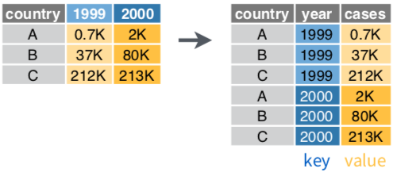
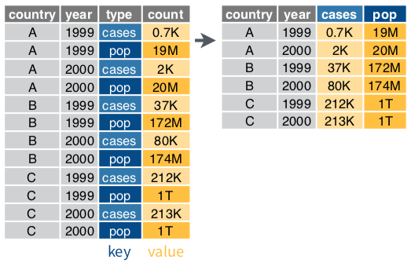
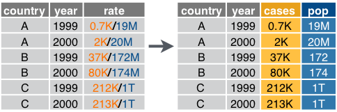
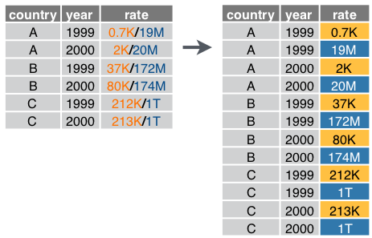
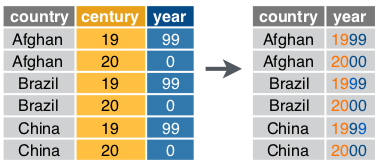

```{r setup, include=FALSE}
knitr::opts_chunk$set(warning = FALSE,
                      echo = TRUE,
                      message = FALSE,
                      collapse = TRUE,
                      comment = "#>",
                      fig.align = 'center',
                      fig.width = 6,
                      fig_caption = FALSE,
                      cache=FALSE)

```

## Defining tidy data (long-format)

1. Each variable forms a column.
2. Each observation forms a row.
3. Each type of observational unit forms a table.

**Tools for reshaping dataframe:**

| Packages     | to long | to wide                        |
|--------------|---------|--------------------------------|
| **tidyr**    | gather  | spread                         |
| reshape2     | melt    | dcast                          |
| **pandas**   | melt    | unstsack / pivot_table / pivot |
| spreadsheets | unpivot | pivot                          |
| databases    | fold    | unfold                         |

Example:

```{r}
library(magrittr)
library(tidyr)
library(dplyr)
library(readr)

# Wide data
preg <- read_csv("http://bit.ly/preg-wide1")
preg2 <- read_csv("http://bit.ly/preg-wide2")
```

```{r, echo=FALSE}
knitr::kable(preg)
knitr::kable(preg2)
```

Long data

```{r echo=FALSE}
preg_long <- preg %>% 
  gather(treatment, n, treatmenta:treatmentb) %>%
  mutate(treatment = gsub("treatment", "", treatment)) %>%
  arrange(name, treatment)
knitr::kable(preg_long)
```


## Tidying

1. Specifying **variables** and **values**. (it depends)
2. Put all **values** in the cells.
3. Put **variables** back to columns.

### Tidyr variables

#### `gather(key, value, ...cols_to_gather)` 



#### `spread(data, key, value, fill = NA, convert = FALSE, drop = TRUE, sep = NULL)`



#### `seperate()`



#### `seperate_rows()`



#### `unite()`



### 狀況1: 欄位名稱是值

```{r}
pew <- read_csv("http://bit.ly/pew-csv")
```

```{r, echo=FALSE}
head(pew) %>% knitr::kable(escape = F)
```


3 variables:

- religion
- income
- frequency


```{r}
?gather

pew %>%
  gather(key = income, value = frequency, -religion)
```


### 狀況2: Multiple variables stored in one column

### 狀況3: 


