```{r setup, include=FALSE}
knitr::opts_chunk$set(warning = TRUE,
                      echo = TRUE,
                      message = FALSE,
                      collapse = FALSE,
                      comment = "#>",
                      fig.align='center',
                      fig.width = 6,
                      cache=FALSE)
library(magrittr)
library(readr)
library(dplyr)
library(tidyr)
library(ggplot2)
library(ggrepel)
library(cowplot)

old_theme <- theme_set(theme_light())
```

## ggplot2 簡介

- [`ggplot2`](http://ggplot2.org) 是一個很強大的資料探索及視覺化工具，
是許多最有影響力的 R 套件開發者 [Hadley Wickham](http://had.co.nz) 所開發
- 所有繪圖函數都有背後的視覺化邏輯（[Grammar of Graphics](http://www.amazon.com/The-Grammar-Graphics-Statistics-Computing/dp/0387245448)）

__Grammar of Graphics__ 的作用就是幫助我們將圖表拆解成個別的元素，
然後將這些元素按照邏輯個別操作，***正確***又***簡單***地達到圖表的目的

> It is far better to learn a language by actually speaking it!

## 一個例子學會畫圖：mpg 🚗油耗資料

`mpg` dataset:  
Fuel economy data from 1999 and 2008 for 38 popular models of car.

| variable     | detail                                               |
|--------------|------------------------------------------------------|
| manufacturer | 車廠                                                 |
| model        | 型號                                                 |
| displ        | 引擎排氣量                                           |
| year         | 出廠年份                                             |
| cyl          | 氣缸數                                               |
| trans        | 自／手排                                             |
| drv          | f = front-wheel drive, r = rear wheel drive, 4 = 4wd |
| cty          | city miles per gallon 城市駕駛油耗                   |
| hwy          | highway miles per gallon 高速公路駕駛油耗            |
| fl           | 汽油: ethanol E85, diesel, regular, premium, CNG     |
| class        | 車型                                                 |

#### 一個例子學會畫圖：mpg

先看兩個變數：

1. displ - 引擎排氣公升
2. hwy - (油耗效率，哩/加侖)

- 大引擎的車子更耗油嗎？如果是的話，那有多耗油？
- 引擎大小和油耗效率之間的關係為何？正/負相關？線性/非線性？相關程度？

### Scatterplots

```{r}
library(ggplot2)
ggplot(data = mpg) +
  geom_point(mapping = aes(x = displ, y = hwy))
```

從圖表可歸納幾個結論：

1. 兩變數為高度負相關 ── 大引擎 => 低效率
2. 有些車是離群值

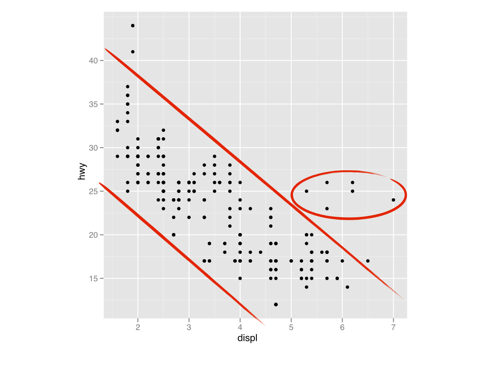

```{r, eval=FALSE, include=FALSE}
ggplot(data = mpg, mapping = aes(x = displ, y = hwy)) +
  geom_point() +
  geom_point(data = dplyr::filter(mpg, displ > 5, hwy > 20), colour = "red", size = 2.2)
```


### Exercise: 用 `mpg` 資料畫不同的圖

看看不同變數之間的相關

- 畫出 scatterplot: `hwy` vs `cyl`
- 畫出 scatterplot: `class` vs `drv`

**Answer-1**

```{r, message=FALSE}
## hwy vs cyl
ggplot(data = mpg) +
  geom_point(mapping = aes(x = hwy, y = cyl))
```

**Answer-2**

```{r, message=FALSE}
## class vs drv
ggplot(data = mpg) +
  geom_point(mapping = aes(x = class, y = drv))
```


## Aesthetic Mapping

- 在 **Grammar of Graphics** 裡面最重要的概念就是 **"Aesthetic Mapping"**
- 在畫圖前我們先來練習用眼睛👀看 **aethetics**

### Exercise: 觀察 Aesthetic Mapping

- 有哪些變數 variables
- 分別對應到哪個 aethetic

**Aesthetics 基本題 1**


```{r, echo=FALSE}
ggplot(data = mpg) +
  geom_point(mapping = aes(x = displ, y = hwy, color = class), size = 3)
```

在 x-y 二維的 Scatterplot 加入第三個 aesthetic

- x = displ
- y = hwy
- color = class (把 class 對應到點的**顏色**)
- hint: `?geom_point`: 查詢支援的 aesthetics

```{r, eval=FALSE}
ggplot(data = mpg) +
  geom_point(mapping = aes(x = displ, y = hwy, color = class))
```

**Aesthetics 基本題 2**

```{r, echo=FALSE, message=FALSE, warning=FALSE}
ggplot(data = mpg) +
  geom_point(mapping = aes(x = displ, y = hwy, shape = class))
```

- x = displ
- y = hwy
- shape = class

```{r, eval=FALSE}
ggplot(data = mpg) +
  geom_point(mapping = aes(x = displ, y = hwy, shape = class))
```

**Plot Exercise**

試試在 x-y 二維的 Scatterplot 加入第三個 aesthetic

- 把 class 對應到點的**形狀**

**Answer**

```{r}
ggplot(data = mpg) +
  geom_point(mapping = aes(x = displ, y = hwy, shape = class))
```


### Aesthetic Mappings 小結

```{r, eval=FALSE}
ggplot(data = <DATA>) + # Data
  geom_<xxx>(
     mapping = aes(<MAPPINGS>), ##  <= Aesthetic mappings
     stat = <STAT>,
     position = <POSITION>
  ) +
  scale_<xxx>() + coord_<xxx>() + facet_<xxx>()
  theme_()
```

- `aes()` 可以放在：
    - `ggplot()`裡面 -- **有**"記憶效果"(成為所有圖層預設)
    - 外面 `+ aes()` -- **有**"記憶效果"(成為所有圖層預設)
    - `geom_<xxx>()`裡面 -- **無**"記憶效果"(只對該 geom 有效)
- `geom_<xxx>(inherit.aes=FALSE)`: overrides the default aesthetics.


### Static Aesthetic

有時候你可能只想要手動設定某個固定 aesthetic，這裡的設定只為了美觀，
並不會帶出多餘資料訊息。

- 將 aesthetic 放在 aes() 裡面: map aesthetic 並自動建立 legend
- 將 aesthetic 放在 aes() 之外: 手動設定某個固定 aesthetic

```{r}
ggplot(data = mpg) +
  geom_point(mapping = aes(x = displ, y = hwy), color = "blue")
```

### Aesthetics 不只這些

如何查？

- `?geom_`: 各 **geom** 有不同支援的 aesthetics

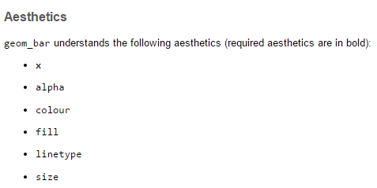


## `ggplot()`

There are two main plotting functions in `ggplot2`:

- `qplot()`: (quick plot) 需要快速畫圖時才使用，用法和 R 的內建繪圖函數 `plot()` 差不多
- `ggplot()`: 推薦的繪圖方法，搭配繪圖步驟的其他函數逐步建構圖層

### ggplot2 起手式

```{r, eval=FALSE}
ggplot(data = <DATA>) + # Data
  geom_<xxx>(
     mapping = aes(<MAPPINGS>),
     stat = <STAT>,
     position = <POSITION>
  ) + # Layers & Aesthetic mappings
  scale_<xxx>() + coord_<xxx>() + facet_<xxx>() # Position
  theme_()
```

### Data for Plot -- ETL

- 每一欄 (column) 都是一個(繪圖)變數
- 每一列 (row) 都是一筆觀察值
- Wide Format -> Long Format (`tidyr`)
    - [你的資料是寬的還是長的？](https://connerchang.github.io/2016/08/12/long-wide-format/)
    
> 資料和圖表是一體兩面，先有資料才有圖表

以 `mpg` 為例

+ `mpg` 共有 `r ncol(mpg)` 個變數 `r nrow(mpg)` 筆資料
+ 這裡需要的繪圖變數 (aesthetic mapping)
    - x: `displ`
    - y: `hwy`


```{r, echo=FALSE}
print(mpg)
```

### Geoms

這兩張圖差在哪裡？

```{r, echo=FALSE, message=FALSE, fig.width=8, fig.asp=0.5}
library(cowplot)
p1 <- ggplot(data = mpg) +
  geom_point(mapping = aes(x = displ, y = hwy))
p2 <- ggplot(data = mpg) +
  geom_smooth(mapping = aes(x = displ, y = hwy))
cowplot::plot_grid(p1, p2)
```

- Geom 決定圖表呈現的「**幾何圖形物件**」，也就是你眼睛看到的資料呈現方式
- `geom_<xxx>()`

```{r}
ggplot(data = mpg) +
  geom_point(mapping = aes(x = displ, y = hwy))
```

```{r}
ggplot(data = mpg) +
  geom_smooth(mapping = aes(x = displ, y = hwy))
```

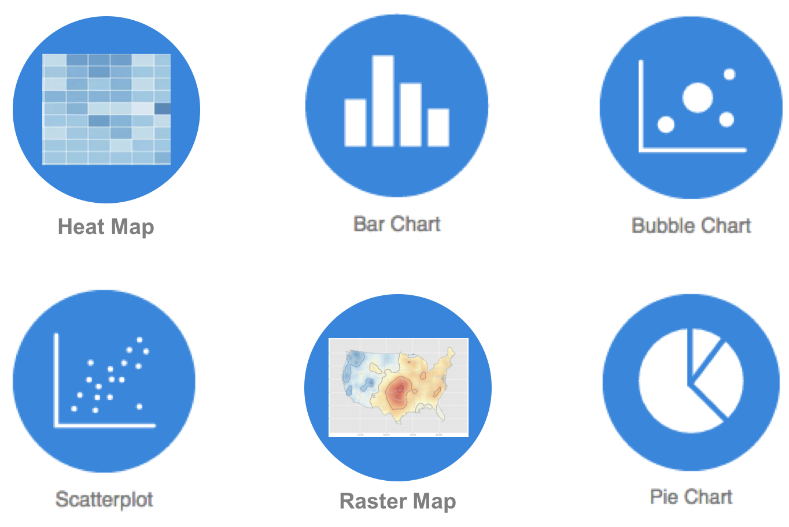

- 因為 Geoms 真的太多了，通常要用的時候再去查: [RStudio - ggplot2 Cheatsheet](https://github.com/rstudio/cheatsheets/raw/master/data-visualization-2.1.pdf)
- 如同前面所述，不同 Geoms 有不同支援的 Aesthetics


#### (附錄) Geoms -- Cheatsheet


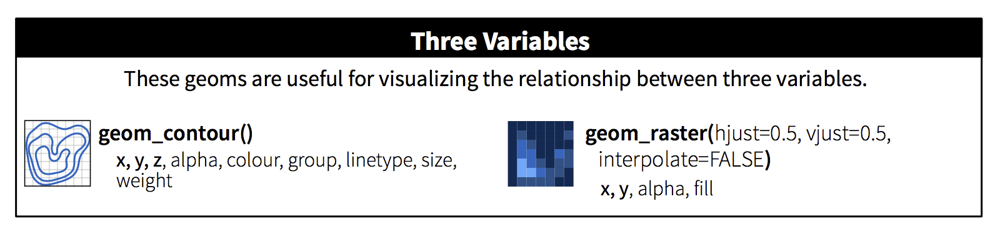


### Bar Charts

- 各種車型(`class`)的數量？
- `geom_bar()`

```{r}
ggplot(data = mpg) +
  geom_bar(mapping = aes(x = class))
```

在畫圖之前，你可能要先想到畫出這樣的表格：

```{r, echo=FALSE}
mpg %>% 
  group_by(class) %>% 
  tally %>% 
  knitr::kable()
```

#### 表格與視覺化的關聯

- 表格就是一種視覺化的方式，有時候一張好的表格資訊就很清楚
- 畫圖只是將這些資訊再強調出來

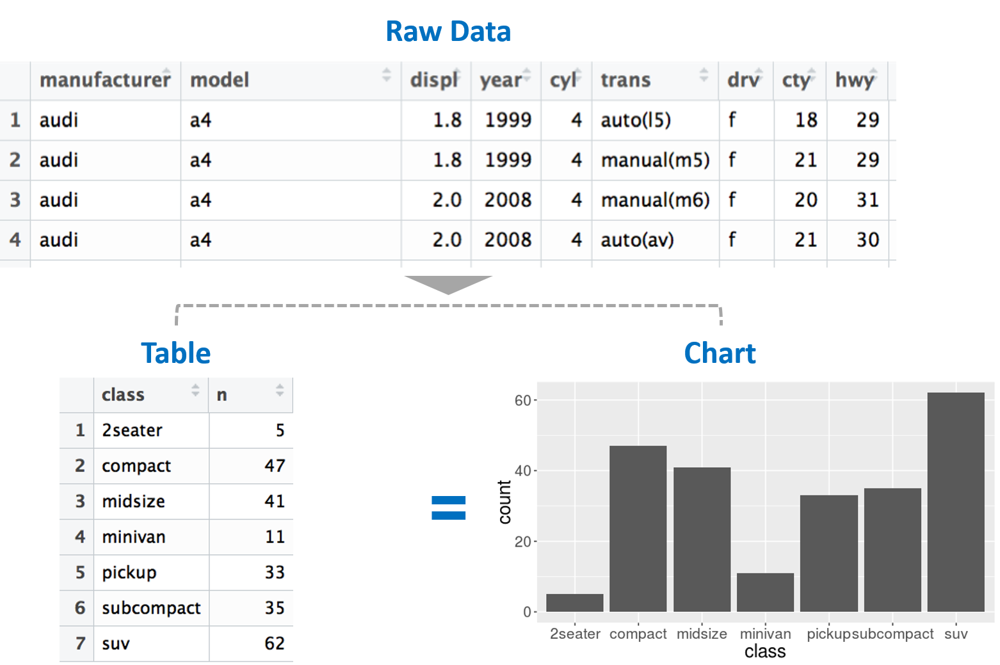

#### Try Bar Charts

- 填滿顏色 `fill`

(錯誤示範：不建議同一變數 mapping 多個 aes)

```{r}
ggplot(data = mpg) +
  geom_bar(mapping = aes(x = class, fill = class))
```

### Stats (Geom 的一體兩面)

- `stat_<xxx>()`
- 有些 Geom (例如 scatterplot) 畫的是 **raw value** (stat_identity)
- 有些 Geom (例如 barplot)會計算新的 stat (e.g., count) 以供畫圖
- 使用 `geom_<xxx>()` 時，要注意預設的 stat 是什麼

> 每個成功的 **Geom** 背後都有一個偉大的 **Stat**

`stat = "identity"`


回頭來看 Aesthetic Mapping

- x: `class`
- y: ?? **count** 不在原本的 `mpg` 資料中

到底 **count** 是怎麼算出來的？

1. 原本可能在 Excel 算
2. R 幫你算 `dplyr::summarise()`
3. ggplot2 `geom_bar` 幫你算

=> `?geom_bar` 的預設 `stat` 是 "count"

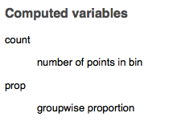

#### Stats 是怎麼幫你算出來的

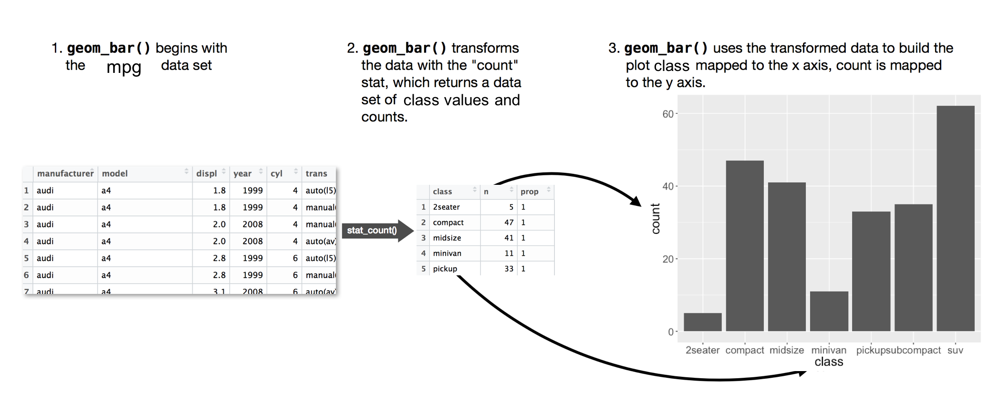

#### 先手動處理 stats 再畫圖

- Plot bar chart with `cut` in dataset `diamonds`

用 `dplyr::summarise()` 算出 count 這個變數，再用 `ggplot2` 畫圖

hint: `stat = "identity"`


```{r, collapse=TRUE, fig.width=6}
d <- mpg %>% 
  group_by(class) %>% 
  summarise(n = n())
d

ggplot(data = d) +
  geom_bar(mapping = aes(x = class, y = n),
           stat = "identity")
```

#### 練習: 有時候遇到複雜的問題就需要手動先算 Stats

- 畫出各種車型(`class`)的平均油耗 bar chart

hint:

- `dplyr::group_by()`
- `dplyr::summarise(mean(xxx))`,  
- `geom_bar(stat = "identity")`

```{r, echo=FALSE, collapse=TRUE, fig.width=6}
d <- mpg %>% 
  group_by(class) %>% 
  summarise(mean_hwy = mean(hwy))
d

ggplot(data = d) +
  geom_bar(mapping = aes(x = class, y = mean_hwy),
           stat = "identity")
```

#### 沒有排序的 bar chart 很難看

- 要怎麼排序？
- `reorder(<要排序的變數>, <參照大小>)`

```{r, collapse=TRUE, fig.width=6}
d <- mpg %>% 
  group_by(class) %>% 
  summarise(n = n())
d

ggplot(data = d) +
  geom_bar(mapping = aes(x = reorder(class, -n), y = n),
           stat = "identity")
```

### Geoms + Stats 實例

- **bar charts**, **histograms**: 計算每一組 bin 裡面的數目.

```{r}
ggplot(data = mpg, aes(x = class)) +
  geom_bar() +
  geom_text(stat = "count",
            aes(label = ..count.., y =..count..),
            vjust = "bottom")
```


- 各種車型的油耗效率
- **boxplots**: plot quartiles.

```{r}
ggplot(data = mpg) +
  geom_boxplot(mapping = aes(x = class, y = hwy))
```


### Layers 圖層觀念

要呈現多個幾何圖形物件 (Geoms) 時要怎麼做到呢？

- 一個 `geom_<xxx>()` 就會在圖上畫一圖層 (Layer)
- 可一層層疊加上去
- 每個圖層甚至可以用不同的 data，在畫進階圖表時很常用到
- 但要注意是否有預設的 aesthetic 不小心 mapping 到該圖層

**兩層圖層**

```{r}
ggplot(data = mpg) +
  geom_point(mapping = aes(x = displ, y = hwy)) +
  geom_smooth(mapping= aes(x = displ, y = hwy))
```


### (附錄) Positions：當圖形在位置打架時要怎麼辦？

- `?geom_bar`
- 堆疊：`position = "stack"` (default)

```{r}
ggplot(data = mpg) +
  geom_bar(mapping = aes(x = class, fill = manufacturer),
           position = "stack") +
  ggtitle('Position = "stack"')
```

**`position`: **

- "identity" 同一位置（覆蓋住後面圖層）
- "stack" 堆疊
- "dodge" 併排
- "fill" 堆疊並 scale 至 100%
- "jitter" "抖..." 點會互相閃避


`position = "identity"`

- 同一位置（覆蓋住後面圖層）

```{r}
ggplot(data = mpg) +
  geom_bar(mapping = aes(x = class, fill = manufacturer),
           position = "identity", alpha = .4) +
  ggtitle('Position = "identity"')
```

`position = "dodge"`

- 併排

```{r}
ggplot(data = mpg) +
  geom_bar(mapping = aes(x = class, fill = manufacturer),
           position = "dodge") +
  ggtitle('Position = "dodge"')
```

`position = "fill"`

- 堆疊並 scale 至 100%

```{r}
ggplot(data = mpg) +
  geom_bar(mapping = aes(x = class, fill = manufacturer),
           position = "fill") +
  ggtitle('Position = "fill"')
```

### Facets: Small-Multiples

Too many variables!!!!

- 看到剛才的車車油耗🚗，是不是覺得還是很難透過圖表理解資料？
- 剛才畫的圖因為多了第3個變數，所以更難理解了

```{r, echo=FALSE, fig.asp=0.35, fig.width=10}
p1 <- ggplot(data = mpg) +
  geom_bar(mapping = aes(x = class, fill = manufacturer),
           position = "stack") +
  ggtitle('Position = "stack"')
p2 <- ggplot(data = mpg) +
  geom_bar(mapping = aes(x = class, fill = manufacturer),
           position = "dodge") +
  ggtitle('Position = "dodge"')
cowplot::plot_grid(p1, p2)
```

- Facets 是很重要的一個呈現方式，一定要學起來
- 為什麼要用 Facets？
    1. 當同一個座標平面塞入太多變數，會造成大腦無法負荷
    2. 分拆資訊，讓大腦協助腦補更有效率

<a href="https://en.wikipedia.org/wiki/Small_multiple">

</a>

> "Illustrations of postage-stamp size are indexed by category or a label, sequenced over time like the frames of a movie, or ordered by a quantitative variable not used in the single image itself." -- Edward Tufte

<div class="footer">
- http://www.juiceanalytics.com/writing/better-know-visualization-small-multiples
</div>


#### Facet Exercise

各車廠(`manufacturer`)在不同車型(`class`)的數量為何？

先用表格來思考

- 你的（視覺化）表格要怎麼畫別人才會清楚
- 在把表格放到圖表上面

三個變數應該怎麼放：

- manufacturer
- class
- count

**1. Long-format**

是我們在 `ggplot2` 需要拿來畫圖的表格

```{r, echo=FALSE}
mpg %>% 
  group_by(manufacturer, class) %>% 
  tally() %>% 
  head(10) %>% 
  knitr::kable()
```

**2. 直接看就很清楚的表格**

- Pivot 樞紐分析表

```{r, echo=FALSE}
mpg %>% 
  group_by(manufacturer, class) %>% 
  tally() %>% 
  spread(class, n, fill = 0) %>% 
  knitr::kable()
```

**3. 讓視覺化增加資訊的清晰度: `facet_wrap()`**

畫出各車廠(`manufacturer`)在不同車型(`class`)的數量 bar chart

- x: class
- y: count
- <s>fill</s> 刪掉多餘的 mapping
- facet: manufacturer

```{r, fig.width=10, fig.asp=0.8}
ggplot(data = mpg) +
  geom_bar(mapping = aes(x = class)) +
  facet_wrap( ~ manufacturer, ncol = 4) +
  theme(axis.text.x = element_text(angle = 90, hjust = 1))
```

- 原則：**一個座標平面(方格)最好不要超過三個變數**
- Don't [overplotting](http://www.perceptualedge.com/articles/visual_business_intelligence/over-plotting_in_graphs.pdf)
- 拆出類別變數 (nominal) 放在個別的小方格 (facets)

> 當變數很多時 Faceting 就是你最好的朋友！


### Labels

圖表一定要有標題，別人才知道你要講的故事是什麼

#### Title 標題

```{r}
ggplot(data = mpg, mapping = aes(x = displ, y = hwy)) +
  geom_point(mapping = aes(color = class)) +
  geom_smooth() + 
  ggtitle("Fuel efficiency vs. Engine size")
```

#### 標題 + 座標軸

```{r}
ggplot(data = mpg, mapping = aes(x = displ, y = hwy)) +
  geom_point(mapping = aes(color = class)) +
  geom_smooth() + 
  ggtitle("Fuel efficiency vs. Engine size") +
  xlab("Engine displacement (L)") +
  ylab("Highway fuel efficiency (mpg)") 
```

#### (附錄) Theme

```{r}
ggplot(data = mpg, mapping = aes(x = displ, y = hwy)) +
  geom_point(mapping = aes(color = class)) +
  geom_smooth() +
  theme_bw()
```

ggplot2 內建 theme


Theme 相關套件:

- [`ggthemes`](https://cran.r-project.org/web/packages/ggthemes/vignettes/ggthemes.html) (推薦)
- [`ggthemr`](https://github.com/cttobin/ggthemr)


### Learning from copying 從抄別人的圖表學起

- Google: "圖表名稱 + R"
- 如果要用得順手，平常就要多看別人畫的好圖，要用時才知道從哪裡找起
- Google 是學習畫圖的好朋友
    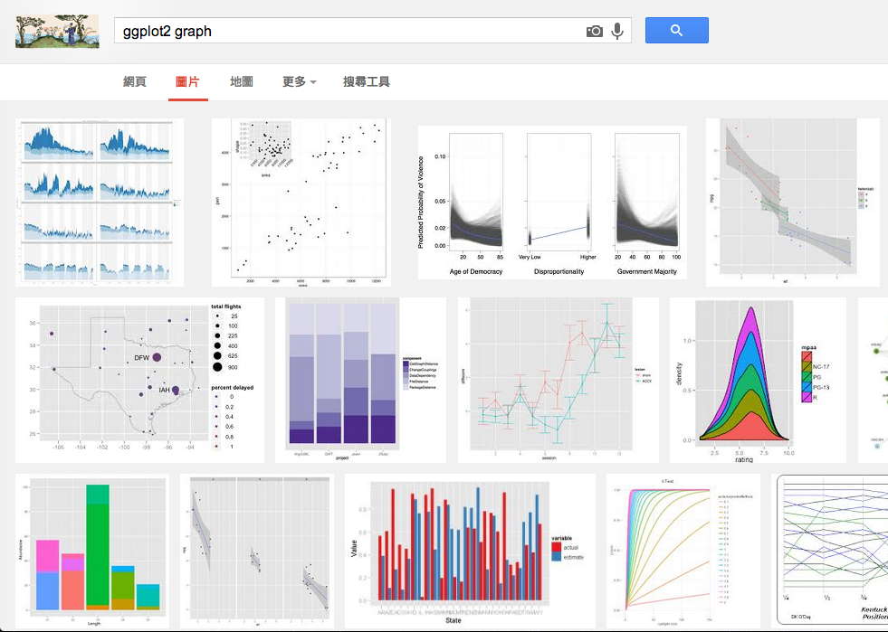
- [視覺化資源整理](#Resources)


### Export Plots 匯出圖表

```{r, eval=FALSE}
p <- ggplot(data = mpg, mapping = aes(x = displ, y = hwy)) +
  geom_point(mapping = aes(color = class)) +
  geom_smooth() +
  theme_bw()

ggsave(p,
       filename = "my_plot.png",
       device = "png", h = 2, w = 3, type = "cairo")
```

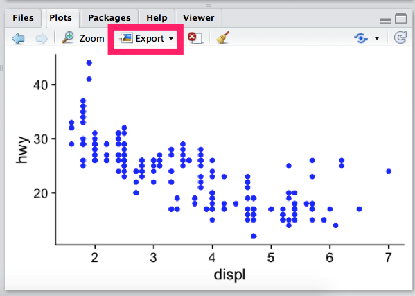

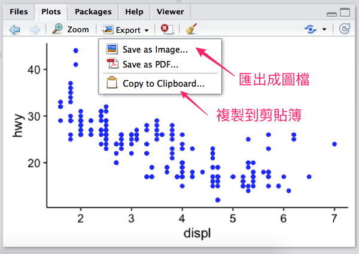

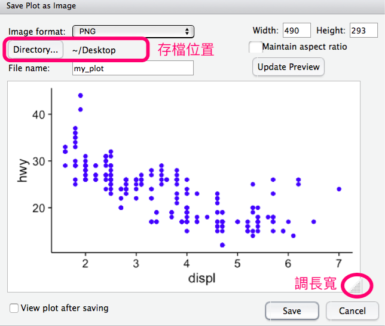


## ggplot2 視覺化流程總結

ggplot2 的繪圖流程

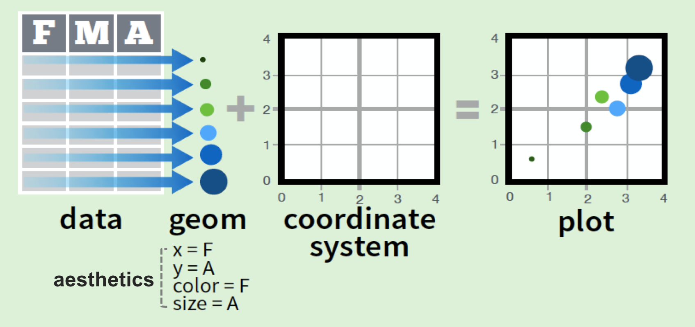

1. **Data** (noun/subject)
2. **Aesthetic mappings** (adjectives): x, y, color, size, ...
3. **Layers**: Geom (verb), Stat (adverb)
4. **Position** (preposition): Scales, Coord, Facet
5. **Theme**

視覺化流程 (非常重要！)

+ Issue: 這張圖表想解決的問題是什麼？
+ Variables
    - variables needed from the data
+ Geoms
    - **bar chart**, **line chart**, **heat map**, ...
+ Aesthetic Mapping
    - x:
    - y: 
    - ...

## HW: 畫自己的圖

- 找出一張平常會畫的圖表，以及其資料，填入上面格式
- 試著用 `ggplot2` 畫出來
    - 資料匯入
    - 資料前處理
    - 畫圖
    - 匯出成 png


<!-- ## 如何匯入資料 -->

<!-- 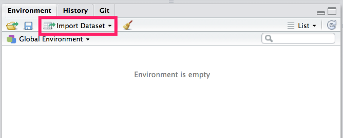 -->

<!-- 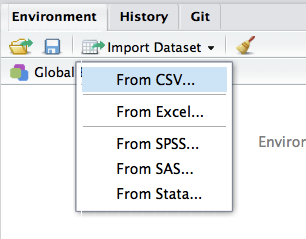 -->

<!-- 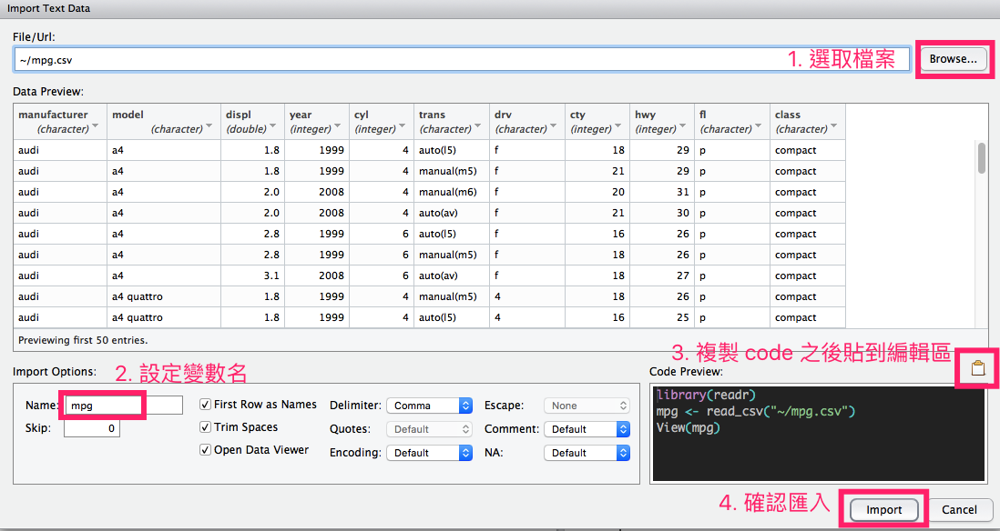 -->


## Resources 視覺化資源整理

#### Data Cleansing (ETL)

- dplyr
- tidyr
- broom

#### ggplot2 Cookbook and Documentation

- [ggplot2 官方使用手冊](http://docs.ggplot2.org/current/): 完整範例細節
- [Cookbook for R - Graphs](http://www.cookbook-r.com/Graphs/): 此站其他學習資源也很推薦

#### ggplot2 輔助繪圖

- [RColorBrewer](http://bxhorn.com/rcolorbrewer-palettes/): 色票
- [ColorBrewer by PennState University](http://colorbrewer2.org/): Web tool for guidance in choosing choropleth map color schemes, based on the reasearch of Dr. Cynthia Brewer.
- [cowplot](https://cran.r-project.org/web/packages/cowplot/vignettes/introduction.html): 組合圖表
- [ggrepel](https://cran.r-project.org/web/packages/ggrepel/vignettes/ggrepel.html): labeling ggplot
- [directlabels](http://directlabels.r-forge.r-project.org/docs/): labeling ggplot (has few bugs)
- [lemon](https://github.com/stefanedwards/lemon): Refresh axis lines, facets, pointpath

#### ggplot2 延伸套件整理

- [ggplot2 Extensions & Gallery](https://www.ggplot2-exts.org/)

#### Cheatsheet

- [RStudio - ggplot2 Cheatsheet](https://github.com/rstudio/cheatsheets/raw/master/data-visualization-2.1.pdf)


#### Other Viz Packages

- [sjPlot](http://www.strengejacke.de/sjPlot/): 快速繪製統計模型和表格 (html output)
- [sjmisc](https://github.com/sjPlot/sjmisc): Utility and recode functions for R and sjPlot. 處理問卷 variable, label, spss file, ...
- [dygraphs](http://rstudio.github.io/dygraphs/): (RStudio) 動態繪製 time-series data
- [leaflet](https://rstudio.github.io/leaflet/): [Leaflet](http://leafletjs.com/) 地圖
- [ggvis](http://ggvis.rstudio.com/): (hadley) 動態圖表，可搭配 Shiny，尚未有完整應用體系
- [rCharts](https://github.com/ramnathv/rCharts): (停止開發很久) 動態圖表

#### R Plot Galleries

- [R Graph Catalog - Creating More Effective Graphs](http://shiny.stat.ubc.ca/r-graph-catalog/): 有效圖表的最簡範例集
- [R 動態圖表套件集 - htmlwidgets](http://gallery.htmlwidgets.org/)
- [RStudio - Quick list of useful R packages](https://support.rstudio.com/hc/en-us/articles/201057987-Quick-list-of-useful-R-packages)
- [THE R GRAPH GALLERY](http://www.r-graph-gallery.com/)
- [R graph gallery](http://rgraphgallery.blogspot.tw/)

#### Other Plot Galleries

- [The Data Visualisation Catalogue](http://www.datavizcatalogue.com/index.html): 各種圖表類型範例
- [The Economist - Graphic detail](http://www.economist.com/blogs/graphicdetail): 看經濟學人如何用圖表說故事

#### 視覺化心法

- [junkcharts](http://junkcharts.typepad.com/)
- [Stephen Few - Perceptual Edge](http://www.perceptualedge.com/examples.php)
- [資料視覺化](hhttp://blog.infographics.tw/category/%E5%BF%83%E6%B3%95/)

