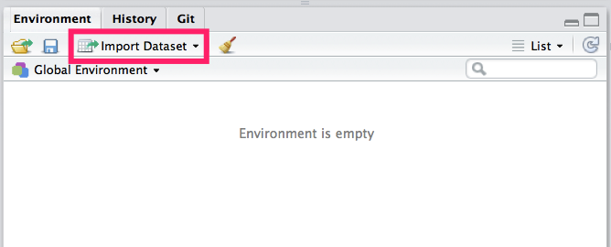

```{r setup, include=FALSE}
knitr::opts_chunk$set(warning = FALSE,
                      echo = TRUE,
                      message = FALSE,
                      collapse = TRUE,
                      comment = "#>",
                      fig.align = 'center',
                      fig.width = 6,
                      fig_caption = FALSE,
                      cache=FALSE)
```

## Load packages

```{r}
library(magrittr)
library(readr)
library(dplyr)
library(tidyr)
library(ggplot2)
library(ggrepel)

old_theme <- theme_set(theme_light())
```

## 如何匯入資料




## Movie dataset

```{r}
movie <- read_
```

